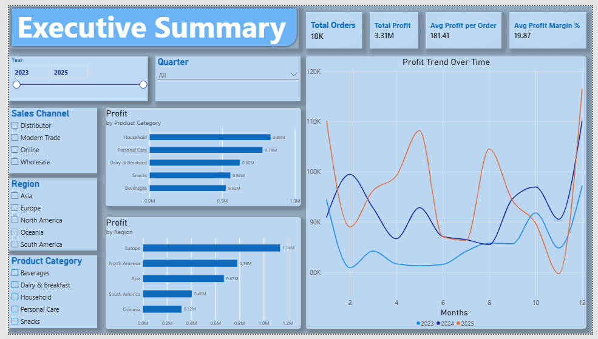
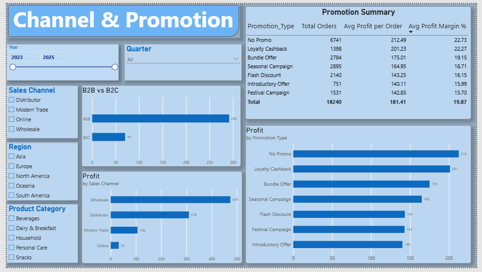
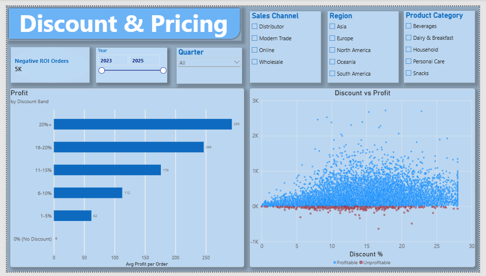

# FMCG Sales Profit Analysis

An end-to-end data analytics project covering 18,240 FMCG order transactions across five regions and five product categories from 2023 to 2025. The analysis combines SQL-based reporting, a Power BI dashboard, and a machine learning model to understand what drives order-level profitability and predict it before an order is confirmed.

---

## Business Questions Answered

- Which sales channels, regions, and product categories generate the most profit?
- Do promotional campaigns actually improve margins, or do they erode them?
- At what discount level does an order become unprofitable?
- How efficiently is marketing spend converting to profit?
- Can we predict whether an order will be profitable before it is finalised?

---

## Key Findings

**Channel performance is the largest driver of profit.** Wholesale orders averaged $473 profit per order compared to just $32 for Online - a 14x difference. Distributor orders came in second at $310. This suggests that channel mix decisions have a far greater impact on profitability than product or pricing decisions alone.

**B2B customers outperform B2C by 4x on average profit.** B2B orders averaged $292 per order against $70 for B2C. Despite B2C representing a meaningful share of order volume, it contributes disproportionately less to total profit.

**Promotions reduce profit without improving margin.** Orders with no promotion averaged $212 profit, which was the highest of any promotion category. Every promotional type underperformed the no-promo baseline, with Introductory Offers and Festival Campaigns performing worst at $140 average profit. This raises a direct question about whether promotional spend is being allocated effectively.

**Europe leads on profitability; Asia trails significantly.** European orders averaged $205 profit versus $152 for Asia - a 35% gap. South America and Oceania sit in the middle with averages around $174–176.

**Personal Care and Dairy are the highest-margin categories.** Personal Care averaged a 26% profit margin and Dairy & Breakfast 25%, compared to just 11% for Beverages. Snacks and Household sit in the middle at 18–23%.

**29% of orders have marketing spend that exceeds the profit generated.** Nearly one in three orders does not recover its marketing cost from the profit on that order, pointing to a need for tighter marketing allocation rules, particularly in the Online channel where average profit is lowest.

**High discounts do not cause unprofitability in isolation.** Counterintuitively, orders with discounts above 15% had a lower unprofitable rate (2.9%) than orders with discounts at or below 15% (5.1%). This suggests other factors - channel, product category, marketing spend - are stronger predictors of loss than discount alone.

---

## Deliverables

**SQL** - schema, five analytical views, and eleven queries covering monthly P&L summaries, regional performance, discount sensitivity analysis, marketing ROI by channel and promotion type, sales person rankings, rolling three-month profit averages, and brand performance within each category. Compatible with PostgreSQL, MySQL, and SQL Server.

**Power BI** - Power Query M script that loads and transforms the raw data, adding all engineered features. Thirty DAX measures covering KPIs, time intelligence (YTD, QTD, year-over-year growth), promotion lift, marketing ROI, and ranking measures. Report layout covers five pages: executive summary, channel and promotion analysis, discount and pricing, geographic drill-down, and ML model results.

**Dashboard Preview**

**Jupyter Notebook** - exploratory data analysis walkthrough covering distributions, categorical breakdowns, scatter plots, and a correlation heatmap. Follows the same analytical logic as the SQL queries and Power BI visuals so the findings are consistent across all three layers.

**Machine Learning Pipeline** - nine regression models trained to predict `Profit_USD` from pre-sale order variables. Gradient Boosting achieved the best performance at 0.93 R², meaning the model explains 93% of the variance in order-level profit using only information available before the order is confirmed. This enables a practical use case: flagging likely unprofitable orders before they are processed.

---

## ML Model Results

| Model              | R²   | RMSE   | MAE   | CV Mean |
|--------------------|------|--------|-------|---------|
| Gradient Boosting  | 0.93 | ~63    | ~38   | 0.93    |
| Random Forest      | 0.92 | ~68    | ~41   | 0.92    |
| Decision Tree      | 0.88 | ~83    | ~45   | 0.86    |
| Ridge Regression   | 0.72 | ~126   | ~90   | 0.72    |
| Linear Regression  | 0.72 | ~126   | ~90   | 0.72    |

Values are approximate. Run the training pipeline to get exact figures for your environment.

---

## Feature Engineering Decisions

Five columns in the raw dataset directly decompose `Profit_USD` — `Gross_Sales_USD`, `Net_Revenue_USD`, `COGS_USD`, `Logistics_Cost_USD`, and `Profit_Margin_Pct`. Including any of them would make the target reconstructable with near-perfect accuracy and produce a model with no real predictive value. All five were dropped before training, which is the most important data quality decision in the project.

Five new features were created from pre-sale variables that would be known before an order is confirmed:

`Effective_Unit_Price` captures what a customer actually pays after discount, rather than the list price.

`Revenue_Estimate` multiplies units sold by the effective unit price to approximate order-level revenue without using the official revenue columns.

`Marketing_Per_Unit` measures how much was spent on marketing per unit sold - a signal of campaign efficiency rather than raw spend.

`Is_Promoted` collapses seven promotion categories into a binary flag. The meaningful distinction for profitability is whether any promotion was active, not which type.

`Is_Q4` flags orders from the fourth quarter. Q4 orders averaged slightly higher profit ($185) than the rest of the year, likely reflecting seasonal demand effects.

---
r. For the Power BI report, follow the instructions in `sql_powerbi/powerbi/POWERBI_SETUP.md`.
